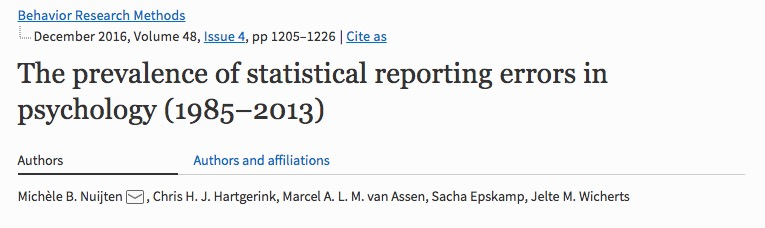
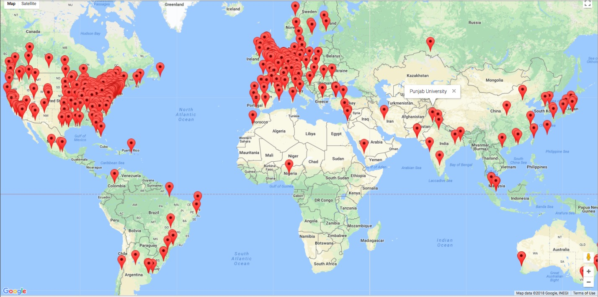
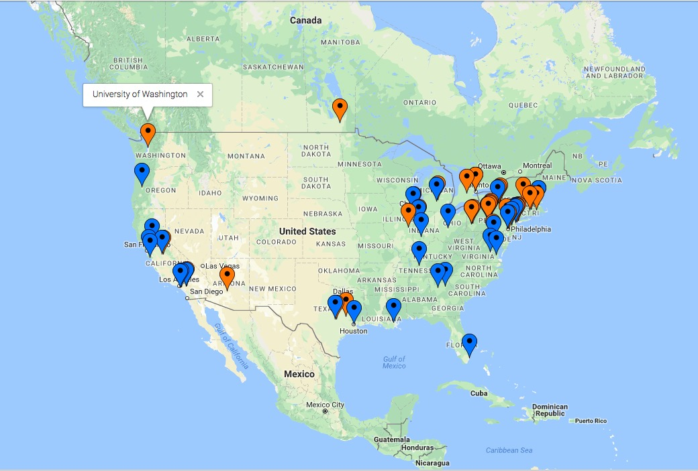
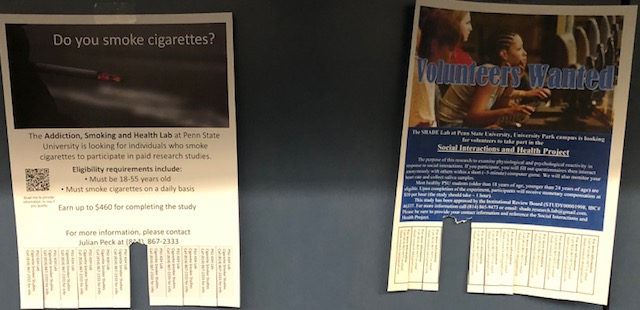

```{r setup, include=FALSE}
if(!("revealjs" %in% installed.packages()[,1])) {
  install.packages("revealjs") }
require("revealjs")
require("DiagrammeR")

knitr::opts_chunk$set(echo = FALSE)
```

# Preliminaries

---


</br>


<div class="notes">
I thank NSF, NICHD, SRCD, and the Sloan Foundation for support.
</div>

## Overview

- A temperature-check about open science
- Is the 'crisis' in behavioral science also sinful?
- Behavioral science is "big data" science
- Quantitative developmental science has a bright future
- Let's not waste a "good" crisis

---


# A temperature check about reproducibility and open science

## Developmental science could be more open & transparent


### Agree | Disagree

## Developmental science *should* be more open and transparent


### Agree | Disagree

## Openness and transparency are related to research robustness (e.g., reproducibility, reliability, impact)


### Agree | Disagree

## Data from developmental research should be more widely and readily available


### Agree | Disagree

## Methods and materials used in developmental research should be more widely and readily available


### Agree | Disagree

## I have used data shared by others


### Agree | Disagree

## If data from publication X or project Y were more widely and readily available, I would use it


### Agree | Disagree

## Unless there are privacy or contractual limitations, data files described in published papers should be readily available in forms reusable by others


### Agree | Disagree

## I use video or audio recordings in my teaching


### Agree | Disagree

## I use video or audio recordings in my current research


### Agree | Disagree

## I can imagine using video or audio recordings in my research


### Agree | Disagree

## I use video or audio recordings to document my research procedures


### Agree | Disagree

## I could envision using video or audio recordings to document my research procedures


### Agree | Disagree

## It's hard to find and access data that I might want to repurpose


### Agree | Disagree

## Once found and accessed, there can be a huge cost in "harmonizing" data from different sources


### Agree | Disagree

## Developments in machine learning, computer vision and related fields are interesting to me


### Agree | Disagree

## I would be interested in using machine learning, computer vision, or related tools in my research under the right circumstances


### Agree | Disagree

## I employ reproducible practices and tools (e.g., SPSS or SAS syntax, R code, Jupyter notebooks) in my research workflows


### Agree | Disagree

## Is there a reproducibility crisis?

>- Yes, a significant crisis
>- Yes, a slight crisis
>- No crisis
>- Don't know

---

<div class="centered">

</br>
<small>
([Baker, 2016](http://doi.org/10.1038/533452a))
</small>
</div>

<div class="notes">
Nature conducted a survey of some 1,600 scientists in 2016. They were asked this question and a few others. Here are the results.
</div>

---

<div class="centered">

</br>
<small>([Baker, 2016](http://doi.org/10.1038/533452a))</small>
</div>

<div class="notes">
</div>

## What does "reproducibility" mean?

## *Methods* reproducibility

- Enough details about materials & methods recorded (& reported)
- Same results with same materials & methods

<small>([Goodman et al., 2016](http://doi.org/10.1126/scitranslmed.aaf5027))</small>

<div class="notes">
Goodman et al. advocate a new lexicon for reproducibility where...
</div>

---

<div class="centered">

</div>

<div class="notes">
I like to call this the "hit by a truck" scenario.
</div>
## *Results* reproducibility

- Same results from independent study

<small>([Goodman et al., 2016](http://doi.org/10.1126/scitranslmed.aaf5027))</small>

<div class="notes">
Goodman et al. advocate a new lexicon for reproducibility where...
</div>

## *Inferential* reproducibility

- Same inferences from one or more studies or reanalyses
    
<small>([Goodman et al., 2016](http://doi.org/10.1126/scitranslmed.aaf5027))</small>

<div class="notes">
Goodman et al. advocate a new lexicon for reproducibility where...
</div>

---

<div class="centered">

</br>
<small>([Baker, 2016](http://doi.org/10.1038/533452a))</small>
</div>

<div class="notes">
These definitions help put some of the presumed causes into perspective.
</div>

## Reproducibility crisis

- Not just behavioral sciences
- "Hard" sciences, too
- Data collection to statistical analysis to reporting to publishing

---

<div class="centered">

</div>

<div class="notes">
Clearly, the significant or slight crisis in reproducibility extends across scientific domains. 
Indeed, the NPR science reporter Richard Harris in a book published earlier this year said that sloppy biomedical research creates worthless cures, crushes hope, costs billions.
But rather than cast aspersions on other fields, let me own the sins of my own.
</div>

# Is the crisis in behavioral science also sinful?

---

<div class="centered">

</div>

<div class="notes">
But rather than cast aspersions on other fields, let me focus on my own field's deadly sins, as cognitive neuroscientist Chris Chambers put it.
</div>

## The sin of unreliability

<div class="centered">

</div>

## Studies are underpowered

<div class="centered">


<small>([Szucs & Ioannides, 2017](http://doi.org/10.1371/journal.pbio.2000797))</small>
</div>

<div class="notes">
As Szucs and Ioannides have shown based on an analysis of more than 10,000 papers in the cognitive neuroscience literature, sample sizes are small, and the probability of false negatives is high, especially for small to medium effect sizes.
</div>

---

<div class="centered">
> "Assuming a realistic range of prior probabilities for null hypotheses, false report probability is likely to exceed 50% for the whole literature."

<small>([Szucs & Ioannides, 2017](http://doi.org/10.1371/journal.pbio.2000797))</small>
</div>

<div class="notes">
So, this means that we may not know what we think we know.
</div>

## The sin of hoarding...

<div class="centered">


...grants, ...students, ...data
</div>

---

<div class="centered">


<small>([Wicherts et al., 2006](http://doi.org/10.1037/0003-066X.61.7.726))</small>
</div>

## The sin of corruptibility...

<div class="centered">
<a href="http://science.sciencemag.org/content/348/6239/1100.2">

</a>

<small>([LaCour & Green, 2014](http://doi.org/10.1126/science.1256151))</small>
</div>

---

<div class="centered">
<a href="http://pubman.mpdl.mpg.de/pubman/item/escidoc:1569964:8/component/escidoc:1569966/Stapel_Investigation_Final_report.pdf">

</a>
</div>

<div class="notes">
- Stapel was Dean of the School of Social and Behavioral Sciences at Tilburg University, teacher of Scientific Ethics course
- Fraud investigation launched when 3 grad students noticed anomalies -- duplicate entries in data tables
- Stapel confessed, lost position, gave up Ph.D., wrote a book
</div>

---

<div class="centered">
<a href="http://www.sciencemag.org/news/2012/09/harvard-psychology-researcher-committed-fraud-us-investigation-concludes">

</a>
</div>

<div class="notes">
- Marc Hauser
- Evolutionary/Comparative Psychologist, Professor at Harvard
- Resigned 2011 after internal investigation found him responsible for research misconduct
- Details see [2012 report by NIH Office of Research Integrity (ORI)](https://grants.nih.gov/grants/guide/notice-files/NOT-OD-12-149.html) and [Hauser's response](http://archive.boston.com/whitecoatnotes/2012/09/05/marc-hauser-responds-federal-finding-scientific-misconduct/spzRWEVIPKA4BUu8wi8t8J/story.html). 
</div>

## The sin of bias...

Bem, D.J. (2011). Experimental evidence for anomalous retroactive influences on cognition and affect. *Journal of Personality and Social Psychology*, *100*(3), 407-425.

> "This article reports 9 experiments, involving more than 1,000 participants, that test for retroactive influence by "time-reversing" well-established psychological effects so that the individual's responses are obtained before the putatively causal stimulus events occur."

<div class="notes">
And this 2011 paper by Daryl Bem from Cornell purporting to show evidence for Extrasensory Perception or precognition. Psychology is harder than physics, but it doesn't supercede it. This paper as blogger Tal Yarkoni [notes](http://www.talyarkoni.org/blog/2011/01/10/the-psychology-of-parapsychology-or-why-good-researchers-publishing-good-articles-in-good-journals-can-still-get-it-totally-wrong/) shows the perils of using standard, but flawed research practices.
</div>

---

<div class="centered">

</div>

<div class="notes">
Yes, Bem was arguing for some sort of "Minority Report"-like evidence for precognition or ESP.
</div>
---

> "We argue that in order to convince a skeptical audience of a controversial claim, one needs to conduct strictly confirmatory studies and analyze the results with statistical tests that are conservative rather than liberal. We conclude that Bem's *p* values do not indicate evidence in favor of precognition; instead, they indicate that experimental psychologists need to change the way they conduct their experiments and analyze their data."

<small>([Wagenmakers et al., 2011](http://doi.org/10.1037/a0022790))</small>

<div class="notes">
But a careful, post-publication re-evaluation showed that Bem had made a number of small, defensible given current practices, errors that accumulated across his paper. None of them were picked up in review.
</div>

## The sin of hurrying...

<div class="centered">
<a href="http://doi.org/10.3758/s13428-015-0664-2)">

</a>
</div>

---

<div class="centered">

</div>

<small>([Nuijten et al., 2015](http://doi.org/10.3758/s13428-015-0664-2))</small>

<div class="notes">
Statistical reporting errors in the published literature are more common that many might think.
</div>

## The sin of narrowmindedness...

> "...psychologists tend to treat other peoples’ theories like toothbrushes; no self-respecting individual wants to use anyone else’s."

[Walter Mischel, 2009](https://www.psychologicalscience.org/observer/becoming-a-cumulative-science)

## The sin of pragmatism...

> "Reviewers and editors want novel, interesting results. Why would I waste my time doing careful direct replications?"

Any number of researchers I've talked with

---

<div class="centered">

</div>

## In our defense...

## Behavior multidimensional

<div class="centered">
<video data-autoplay height="550" controls>
  <source src="https://nyu.databrary.org/slot/11652/307774,376273/asset/47075/download?inline=true" type="video/mp4">
Your browser does not support the video tag.
</video>
<small>([Adolph et al., 2016](https://nyu.databrary.org/volume/232))</small>
</div>

## Embedded in networks

<div class="centered">

</div>

---

<div class="centered">

</div>

## Humans are diverse

But much (lab-based) data collected are from **W**estern, **E**ducated **I**ndustrialized, **R**ich, **D**emocratic (WEIRD) populations [Henrich et al., 2010](http://doi.org/10.1017/S0140525X0999152X)

<!-- --- -->

<!-- <div class="centered"> -->
<!--  -->
<!-- </br> -->
<!-- <small><http://www.evoanth.net/2015/01/06/evolutionary-psychology-has-problems-and-it-isnt-getting-better/></small> -->
<!-- </div> -->

## Data about humans are sensitive, hard(er) to share

- Protect participant's identities
- Protect from harm/embarrassment
- Anonymize (effective?) or get permission

## Psychology is harder than physics

---

<div class="centered">

</div>

---

<div class="centered">

</div>

## Beyond sin

- No physics envy, but we can learn from physics
- Openness and transparency are means, not the ends
- How do we accelerate, broaden, and deepen discovery?
- Fixing the past vs. building the future

# Behavioral science is "big data" science

## "Mind-reading" in fMRI

<div class="centered">

</br>
<small>([Nishimoto et al., 2011](https://doi.org/10.1016/j.cub.2011.08.031))</small>
</div>

---

```{r mri-workflow}
grViz("
  digraph {
	  style=filled
		color=lightgrey
		node [style=filled, color=lightblue]
    template -> {regis}
		person_i -> {sMRI, fMRI, survey, task, meta}
    sMRI -> regis
    regis -> fMRI
    {survey, task} -> cleaning
    {fMRI, cleaning, meta} -> indiv_analysis
		}")
```

## A personal example

- How does vision develop?
- *Experience*
    - Input +
    - Visually-guided action
- + *Physical* (eye/brain/body) development

## Measure (in the lab)

- Behavioral sensitivity
- Brain responses
- At different ages

---

<div class="centered">
<video data-autoplay loop height="550" controls>
  <source src="https://nyu.databrary.org/slot/9825/-/asset/11645/download?inline=true" type="video/mp4">
  Your browser does not support the video tag.
</video>
</br>
<small>
([Gilmore, 2014](http://doi.org/http://doi.org/10.17910/B7QG6W))
</small>
</div>

<div class="notes">
Using computer-generated displays like this.
</div>

## Children's behavior {.smaller}

<div class="centered">


<small>
([Adamiak et al., 2015](http://doi.org/10.1167/15.12.1008))
</small>
</div>

## Adults' behavior {.smaller}

<div class="centered">


<small>
([Adamiak et al., 2015](http://doi.org/10.1167/15.12.1008))
</small>
</div>

## Children's brain responses {.smaller}

<div class="centered">

</br>
<small>([Gilmore et al., 2015](https://doi.org/10.1371/journal.pone.0157911))</small>
</div>

## Adults' brain responses

<div class="centered">

</br>
<small>([Gilmore et al., 2015](https://doi.org/10.1371/journal.pone.0157911))</small>
</div>

## But, what's the input? The *real* input?

---

<div class="centered">
<video data-autoplay height="550" controls>
  <source src="https://nyu.databrary.org/slot/7740/0,24634/asset/16751/download?inline=true" type="video/mp4">
  Your browser does not support the video tag.
</video>
</br>
<small>
([Gilmore et al., 2015](http://doi.org/10.17910/B7.116))
</small>
</div>

<div class="notes">
What if I had first-person, observer's-eye views of what infants saw...
</div>

---

<div class="centered">
<video data-autoplay height="550" controls>
  <source src="https://nyu.databrary.org/slot/7740/0,24200/asset/16753/download?inline=true" type="video/mp4">
  Your browser does not support the video tag.
</video>
</br>
<small>([Gilmore et al., 2015](http://doi.org/10.17910/B7.116))</small>
</div>

<div class="notes">
And what mothers' saw while they moved together through the very same environment?
</div>

---

<div class="centered">

</br>
<small>
([Adolph, 2015](http://doi.org/10.17910/B7.123))
</small>
</div>

---

```{r optic-flow-video-workflow}
grViz("
  digraph {
	  style=filled
		color=lightgrey
		node [style=filled, color=lightblue]
		{mom_i, baby_i} -> video
    video -> align_clip
    align_clip -> ffmpeg
    ffmpeg -> frame_seq
    frame_seq -> {radial_filt, linear_filt, rot_filt}
    {radial_filt, linear_filt, rot_filt} -> stats
		}")
```

## Frame-by-frame video analysis

<div class="centered"> 
<video data-autoplay height="550" controls>
  <source src="https://nyu.databrary.org/slot/11680/0,24500/asset/41871/download?inline=true" type="video/mp4">
  Your browser does not support the video tag.
</video>
<small>
([Jayaraman et al., 2015](http://doi.org/10.17910/B7988V))
</small>
</div>

<div class="notes">
</div>

---

<div class="centered">
<video data-autoplay height="550" controls>
  <source src="https://nyu.databrary.org/slot/11680/25500,50000/asset/41873/download?inline=true" type="video/mp4">
  Your browser does not support the video tag.
</video>
</div>

---

<div class="centered">
<video data-autoplay height="480" controls>
  <source src="https://nyu.databrary.org/slot/11680/51000,75500/asset/41875/download?inline=true" type="video/mp4">
  Your browser does not support the video tag.
</video>
</div>

## Findings {.smaller}

<div class="centered">


<small>
([Raudies & Gilmore, 2014](http://doi.org/10.1162/NECO_a_00645))
</small>
</div>

## Findings

- Infant (passengers) experience faster visual speeds than mother
- Controlling for speed of locomotion, environment
- Motion "priors" for infants ≠ mothers

## Are "fast" flow speeds common?

<div class="centered">
<video data-autoplay height="550" controls>
  <source src="https://nyu.databrary.org/slot/11630/1567557,1747248/asset/39854/download?inline=true" type="video/mp4">
  Your browser does not support the video tag.
</video>
<small>
([Jayaraman et al., 2015](http://doi.org/10.17910/B7988V]))
</small>
</div>

---

<div class="centered">


</br>
<small>
([Gilmore et al, 2015](http://doi.org/10.1109/DEVLRN.2015.7345450))
</small>
</div>

---

<div class="centered">
| Country | Females | Males | Age (wks) | Coded video Hrs        |
|---------|---------|-------|-----------|------------------|
| India   | 17      | 13    | 3-63      | 3.1 (0.5-6.0) |
| U.S.    | 15      | 19    | 4-62      | 4.6 (0.2-7.6)    |

</br>
</br>
<small>
([Gilmore et al, 2015](http://doi.org/10.1109/DEVLRN.2015.7345450))
</small>
</div>

## Motion speeds - 6 weeks {.flexbox .vcenter .smaller}

<div class="centered">
U.S. | India</br>


</br>
<small>
([Gilmore et al, 2015](http://doi.org/10.1109/DEVLRN.2015.7345450))
</small>
</div>

## Motion speeds -- 34 weeks {.flexbox .vcenter .smaller}

<div class="centered">
U.S. | India</br>

</br>
<small>
([Gilmore et al, 2015](http://doi.org/10.1109/DEVLRN.2015.7345450))
</small>
</div>

## Motion speeds -- 58 weeks {.flexbox .vcenter .smaller}

<div class="centered">
U.S. | India</br>

</br>
<small>
([Gilmore et al, 2015](http://doi.org/10.1109/DEVLRN.2015.7345450))
</small>
</div>

## Linear > radial patterns {.smaller}

<div class="centered">

</br>
<small>
([Gilmore et al, 2015](http://doi.org/10.1109/DEVLRN.2015.7345450))
</small>
</div>

## Simulating developmental change {.flexbox .vcenter .smaller}

<div class="centered">
<small>
$\begin{pmatrix}\dot{x} \\ \dot{y}\end{pmatrix}=\frac{1}{z}
\begin{pmatrix}-f & 0 & x\\ 0 & -f  & y \end{pmatrix}
\begin{pmatrix}{v_x{}}\\ {v_y{}} \\{v_z{}}\end{pmatrix}+
\frac{1}{f}
\begin{pmatrix}
xy & -(f^2+x^2) & fy\\ 
f^2+y^2 & -xy & -fy
\end{pmatrix}
\begin{pmatrix}
\omega_{x}\\ 
\omega_{y}\\ 
\omega_{z}
\end{pmatrix}$
</small>

**Geometry of environment/observer**: $(x, y, z)$</br>
**Translational speed**: $(v_x, v_y, v_z)$</br>
**Rotational speed**: $(\omega_{x}, \omega_{y}, \omega{z})$</br>
**Retinal flow**: $(\dot{x}, \dot{y})$
</div>

## Parameters For Simulation

| Parameter | Crawling Infant | Walking Infant |
|-----------|-----------------|----------------|
| Eye height| 0.30 m          | 0.60 m         |
| Locomotor speed | 0.33 m/s  | 0.61 m/s       |
| Head tilt | 20 deg          | 9 deg          |

<div class="centered">
</br>

</br>
<small>
([Kretch et al., 2014](http://dx.doi.org/10.1111/cdev.12206))
</small>
</div>

---

| Geometric Feature        | Distance |
|--------------------------|----------|
| Side wall                | +/- 2 m  |
| Side wall height         | 2.5 m    |
| Distance of ground plane | 32 m     |
| Field of view width      | 60 deg   |
| Field of view height     | 45 deg   |

## Simulating Flow Fields {.flexbox .vcenter .smaller}

<div class="centered">

</br>
<small>
([Gilmore et al, 2015](http://doi.org/10.1109/DEVLRN.2015.7345450))
</small>
</div>

---

<div class="centered">

</br>
<small>
([Gilmore et al, 2015](http://doi.org/10.1109/DEVLRN.2015.7345450))
</small>
</div>

## Simulated Flow Speeds (m/s) {.flexbox .vcenter}

<div class="centered">
| Type of Locomotion | Ground Plane | Room | Side Wall | Two Walls |
|--------------------|--------------|------|-----------|-----------|
| Crawling           | 14.41        | 14.42| 14.43     |14.62      |
| Walking            | 9.38         | 8.56 | 7.39      |9.18       |
</div>

## Lessons learned

>- Data sharing is **AWESOME**
>- Bigger, densier, richer data sets are **AWESOME**
>- Simulations are **AWESOME**
>- I want to do more **AWESOME** science than I can do on my own

# Quantitative developmental science has a bright future

---


---


## Essentials for computationally intensive behavioral research

- Computational resources
- Technical expertise

## Reproducible workflows

Kitzes, J., Turek, D., & Deniz, F. (Eds.). (2018). The Practice of Reproducible Research: Case Studies and Lessons from the Data-Intensive Sciences. Oakland, CA: University of California Press. [E-book](https://www.gitbook.com/book/bids/the-practice-of-reproducible-research/details).

## **F**indable, **A**ccessible, **I**nteroperable, and **R**eusable (FAIR) data and materials 

Wilkinson, M. D., Dumontier, M., Aalbersberg, I. J. J., Appleton, G., Axton, M., Baak, A., Blomberg, N., et al. (2016). The FAIR Guiding Principles for scientific data management and stewardship. *Scientific Data*, *3*, 160018. Retrieved from http://dx.doi.org/10.1038/sdata.2016.18

---

<a href="http://databrary.org">

</a>

Funded NSF (2012-16), NICHD (2013-18), SRCD (2014-16), & Sloan Fdn (2017-18)

Opened spring 2014

Approaching 1,000 researchers (690+ PIs + 300+ affiliates), 380+ institutions

540+ data/stimulus sets (~20% shared), 13,900+ hours

---

 

Free, open-source, multi-platform video/audio coding tool

Windows OS fix nearly complete

Updates for transcription

## How Databrary differs

- Open sharing among *authorized researchers*, not public
- Share with *community* of researchers, not study-by-study
- Share identifiable data *with permission* via consistent access levels

## How Databrary differs

- Store, search across, filter among participant & session characteristics
- Active (during study) curation reduces *post hoc* burden
- Gilmore, R. O., Kennedy, J. L., & Adolph, K. E. (2018). Practical Solutions for Sharing Data and Materials From Psychological Research. *Advances in Methods and Practices in Psychological Science*, <https://doi.org/10.1177/2515245917746500>

---

<div class="centered">

</div>

## Play & Learning Across a Year (PLAY) Project

---

### Play is the central context and activity of early development

---

### What do parents and infants actually *do* when they play?

---

<div class="centered">
<video width="750" height="500" controls >
  <source src="https://nyu.databrary.org/slot/11652/307774,376273/asset/47075/download?inline=true" type="video/mp4">
Your browser does not support the video tag.
</video>

Adolph, K., Tamis-LeMonda, C. & Gilmore, R.O. (2016). PLAY Project: Webinar discussions on protocol and coding. Databrary. Retrieved January 24, 2018 from https://nyu.databrary.org/volume/232
</div>

---

<div class="centered">
<video width="750" height="500" controls >
  <source src="https://nyu.databrary.org/slot/14167/381504,4603862/asset/59930/download?inline=true" type="video/mp4">
Your browser does not support the video tag.
</video>
Adolph, K., Tamis-LeMonda, C. & Gilmore, R.O. (2016). PLAY Project: Materials. Databrary. Retrieved January 24, 2018 from https://nyu.databrary.org/volume/254.
</div>

---

<div class="centered">

</div>

---

- $n=900$ infant/mother dyads; 300 @ 12-, 18-, 24-months
- 30 dyads from 30 sites across the US
- 1 hr natural activity 
    - 3 min solitary toy play 
    - 2 min dyadic toy play
    - video tour of home

---

- Videos coded for
    - [Emotional expression](https://dev1.ed-projects.nyu.edu/wikis/docuwiki/doku.php/emotion)
    - [Object interaction](https://dev1.ed-projects.nyu.edu/wikis/docuwiki/doku.php/manual3)
    - Physical activity & [locomotion](https://dev1.ed-projects.nyu.edu/wikis/docuwiki/doku.php/manual4)
    - [Full transcript](https://dev1.ed-projects.nyu.edu/wikis/docuwiki/doku.php/transcription), [Communication](https://dev1.ed-projects.nyu.edu/wikis/docuwiki/doku.php/manual2), and [Gesture](https://dev1.ed-projects.nyu.edu/wikis/docuwiki/doku.php/gesture)
- Enhancements to [Datavyu](http://datavyu.org) for transcription, CHAT compatibility, Windows support

---

<div class="centered">


<https://github.com/PLAY-behaviorome/video-coding>
</div>

---

<div class="centered">


<https://github.com/PLAY-behaviorome/video-coding>
</div>

---

### Demographics + parent-report questionnaires about health, family, temperament, vocabulary

---

### Ambient sound levels

---

<div class="centered">

</div>

---

### Census block group geocoding

---

<div class="centered">

</div>

---

<div class="centered">

</div>

---

- Data openly shared on Databrary
    - Adolph, K., Tamis-LeMonda, C. & Gilmore, R.O. (2016). PLAY Project: Materials. Databrary. Retrieved January 24, 2018 from https://nyu.databrary.org/volume/254.
    - Adolph, K., Tamis-LeMonda, C. & Gilmore, R.O. (2017). PLAY Pilot Data Collections. Databrary. Retrieved January 24, 2018 from https://nyu.databrary.org/volume/444

---

### Video as data **AND** documentation

---

<div class="centered">
<a href="http://www.apa.org/science/about/psa/2017/10/video-data.aspx">

</div>

---

<div class="centered">
<a href="https://dev1.ed-projects.nyu.edu/wikis/docuwiki">

</a>
</div>

## What questions would *you* ask about these sorts of data?

## How could the data be made maximimally (re)useful?

## On the horizon..

- Scientific process management (LabNanny), project sync, dataset cloning
- Bringing [machine learning](https://gilmore-lab.github.io/2018-01-26-p2c/#/how-infrastructure-can-enable-open-transparent-and-reproducible-big-data-developmental-science), computer vision to behavioral scientists

# Let's not waste a "good" crisis

---

<div class="centered">
<a href="http://www.nature.com/articles/s41562-016-0021/figures/1">

</a>
</br>
<small>
([Munafo et al., 2017](http://doi.org/10.1038/s41562-016-0021))
</small>
</div>

<div class="notes">
This recent manifesto from Nature Human Behavior describes the risks to reproducible science at every step of the process.
I urge you to read it.
</div>

---

<div class="centered">

</div>

<div class="notes">
If each data point is a brick, a cumulative science of behavior would take each one and turn it into...
</div>

---

<div class="centered">

</div>

<div class="notes">
beautiful, intricate structures of knowledge.
So how do we build a cumulative science?
</div>

## Collect & share video as data and documentation

<div class="centered">

</div>

<div class="notes">
Karen Adolph at NYU is my partner in founding and directing the Databrary project. We have argued that video plays a central role in improving reproducibility in behavioural science. It has uniquely powerful abilities to capture who said or did what when and in what context.
</div>

## Increase sample sizes

<div class="centered">

</div>

Or, ["Building a CERN for Psychological Science"](https://christopherchartier.com/2017/08/26/building-a-cern-for-psychological-science/)

## Standardize metadata

- participants (age, gender, race/ethnicity, ...)
- settings (times, dates, places)
- measures & tasks

<div class="centered">

</div>

## Improve statistical practices

- Automated checking of paper statistics (in American Psychological Association formats) via [Statcheck](http://statcheck.io)
- Redefine "statistical significance" as $p<.005$? [(Benjamin et al., 2017)](https://dx.doi.org/10.17605/OSF.IO/MKY9J)
- Or move away from [NHST](https://en.wikipedia.org/wiki/Statistical_hypothesis_testing) toward more robust and cumulative practices (Bayesian, CI/effect-size-driven) 

## Store data, materials, code in repositories

- Data libraries
- Funder, journal mandates for sharing increasing
- But no long-term, stable, funding sources for curation, archiving, sharing
- ArXiv model
    - Institutional (Cornell) support
    - Subscription

## Build platforms for discovery

- Data + analysis
- e.g., PSU's [Biostars](https://www.biostars.org/)

---

<div class="centered">

</div>

<div class="notes">
This is not pie in the sky.
Let me tell you why.
</div>

---

<div class="centered">

</div>

---

<div class="centered">
<a href="https://en.wikipedia.org/wiki/Hubble_Ultra-Deep_Field">

</a>
</div>

<div class="notes">
The Hubble Ultra Deep Field. Taken over 3.5 months in 2003-04. Contains an estimated 10,000 galaxies, and because time and space collapse at astronomical distances, looks back ~13 billion years, or 400-800 years before the big bang. So what would the Hubble telescope for human health and behavior look like?
</div>

## Data from diverse domains

<div class="centered">
<a href="http://www.thehumanproject.org">

</a>
</div>

---


## Link measures across people

<div class="centered">
<a href="http://www.openhumans.org">

</a>
</div>

## Web-based data visualization, analysis

<div class="centered">
<video width="720" height="450" controls>
  <source src="https://raw.githubusercontent.com/gilmore-lab/sips-2017-databservatory/master/mov/neurosynth-happy.mp4" type="video/mp4">
Your browser does not support the video tag.
</video>
</div>

---

<div class="centered">
<a href="http://www.socialexplorer.com/">
<div class="centered">

</div>
</a>
</div>

---

<div class="centered">
<video width="720" height="450" controls>
  <source src="https://raw.githubusercontent.com/gilmore-lab/sips-2017-databservatory/master/mov/wordbank-vocabulary.mp4" type="video/mp4">
Your browser does not support the video tag.
</video>
</div>

## Search, filtering by personal characteristics

<div class="centered">
<a href="http://ndar.nih.gov">

</a>
</div>

## Curate data & materials as they are generated

<div class="centered">

</div>

## Consistent, clear sharing permissions structure

<div class="centered">

</div>

## And/or let individuals own/profit from their own data


Boker, S. M., Brick, T. R., Pritikin, J. N., Wang, Y., von Oertzen, T., Brown, D., Lach, J., et al. (2015). Maintained Individual Data Distributed Likelihood Estimation (MIDDLE). Multivariate behavioral research, 50(6), 706–720. Taylor & Francis. Retrieved from http://dx.doi.org/10.1080/00273171.2015.1094387

## Compete over findings, not participants...

<div class="centered">


</div>


## Progress

| Example | Multi-measure | Indiv link/search | Visualize | Self-curate | Permissions |
|---------|---------------|------------|-----------|-------|----|
| Databrary   | &#x2714; | &#x2714; | tabular | &#x2714; |&#x2714; |
| Human Proj  | &#x2714; | &#x2714; | ? | ? | &#x2714; |
| ICPSR       | &#x2714; | ? | &#x2714; | ? | &#x2714; |
| Neurosynth  | fMRI BOLD | group data | &#x2714; | public | NA |
| OpenNeuro   | &#x2714; |   ?       | &#x2714; | &#x2714; | public |
| Open Humans | &#x2714; | &#x2714; | ? | ? |  &#x2714; |
| OSF         | &#x2714; |          | | &#x2714; | public |
| WordBank    | M-CDI | group metadata | &#x2714; | ? | public |

---

<div class="centered">

</div>

<div class="notes">
In closing, I'd like us to step outside of our narrow disciplinary silos.
</div>

---

<div class="centered">

</div>

<div class="notes">
To make the future of big data behavioral science one where we're not just blind men studying our small part of the elephant.
</div>

---

<div class="centered">

</div>

<div class="notes">
But where we take off our opaque glasses and embrace the whole glorious animal.
</div>

---

<div class="centered">

</div>

<div class="notes">
Let's build it here.
</div>

---
<div class="centered">

</div>

## Keep in touch {.vcenter .flexbox}

### rogilmore@psu.edu
### [gilmore-lab.github.io](http://gilmore-lab-github.io)

## Stack

This talk was produced on `r Sys.Date()` in [RStudio](http://rstudio.com) using R Markdown and the reveal.JS framework.
The code and materials used to generate the slides may be found at <https://github.com/gilmore-lab/2018-02-14-quant-dev/>.
Information about the R Session that produced the code is as follows:

```{r session-info}
sessionInfo()
```
